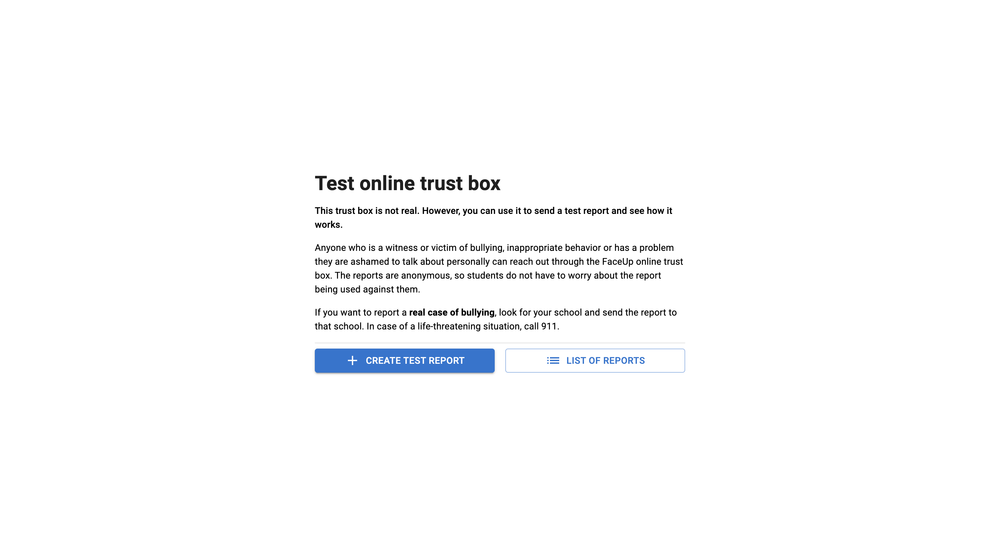
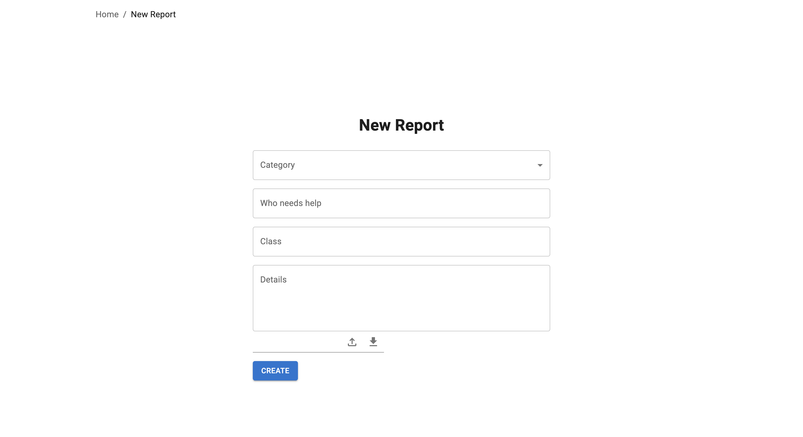
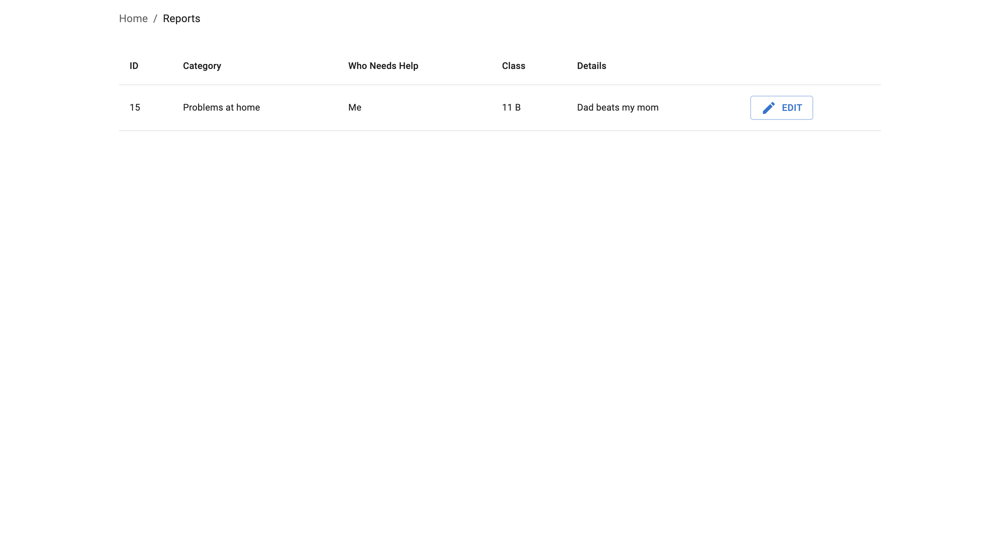
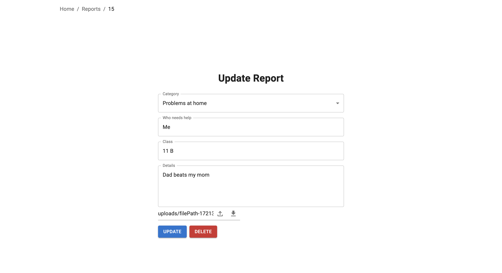

# FaceUp Interview Task

## Task Description

The goal of this task is to create a simplified application that allows users to manage reports. The application should support:

- Creating new reports.
- Viewing all reports.
- Viewing details of a specific report.
- Editing and deleting a report from its details view (**Including files**).

The application should include:
- Ability to upload files.

**Note:** User registration and login are not required; everything should be handled with a single fixed account.

To get an idea of the visual interface, you can refer to our application at [https://app.nntb.cz](https://app.nntb.cz) and select “Testovací škola”.

**Note:** The original task can be found in `Task.pdf` in czech

## Technical Details

- **Project**: TypeScript, React.
- **Backend**: Typescript, Node.js, Express, Typeorm, REST API.
- **Database**: PostgreSQL

## How to Get Started

1. Clone this repository.
2. Follow the setup instructions in the respective `README` files for the frontend and backend.

### Set Up the Backend

Navigate to the server directory, install all the dependencies and run it:

```bash
cd server
npm install
npm start
```

### Set Up the Frontend

The same goes for the client application:
```bash
cd ../client
npm install
npm start
```

### Set Up the Database

For this we will use docker image of postgreSQL database:
```bash
$ docker run --name some-postgres -e POSTGRES_PASSWORD=test POSTGRES_USER=test -d db
```

**Note:** File with database configurations is located at `server/src/data-source.ts`

## Screenshorts

Main view of the application

Creating report

Veiwing all the created reports

Updating reports
